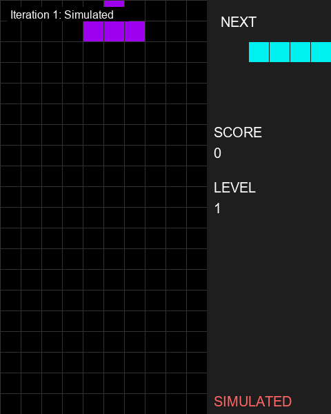

# Tetris AI Agent Documentation

This is an AI agent system that can automatically play Tetris. The system uses AI models to control the game, achieving automated gameplay.

## AI Iterator Files

The system includes multiple AI iterator files that can be used to control Tetris with different AI models. These are the core components of the system:

### AI Model Comparison

Below is a visual comparison of different AI models playing Tetris:

| Claude Sonnet 3.7 | Gemini Flash 2.0 | OpenAI o3-mini | Qwen 2.5 VL 72B Instruct|
|:----------:|:----------:|:--------------:|:--------------:|  
|  |  |  |  |
| *Claude's vision-based analysis* | *Gemini's approach to Tetris* | *OpenAI's decision making* | *Qwen's reasoning* |

> Note: Some GIFs may be placeholders until recordings for all models are available.

### tetris_claude_iterator.py

This file specifically uses Claude models from Anthropic to play Tetris:

  
  *Claude AI playing Tetris through vision-based analysis*

- **Supported Models**:
  - Claude 3.7 Sonnet (default)
  - Other Claude models can be specified with the --model parameter

- **Key Features**:
  - Designed specifically for Claude models
  - Direct integration with Anthropic's API
  - Includes simulation capabilities for testing
  - Provides detailed logging of Claude's responses
  - Can capture real screenshots or use simulated boards

- **Usage**:
  ```bash
  # Use default Claude model
  python tetris_claude_iterator.py
  
  # Specify a different Claude model
  python tetris_claude_iterator.py --model claude-3-opus-20240229
  
  # Use simulation mode with complex board
  python tetris_claude_iterator.py --complex
  
  # Use real screenshots instead of simulation
  python tetris_claude_iterator.py --no-simulate
  ```

### tetris_ai_iterator.py

This is the main, unified iterator that supports multiple AI models through different providers:

- **Supported Models**:
  - OpenAI o3-mini (direct API) Tested
  - Qwen2.5 VL 72B Instruct (via 302.ai API) Tested
  - Gemini 2.0 Flash (default, via OpenRouter)
  - Gemini Pro 2.0 Experimental (via OpenRouter)
  - Qwen2.5 VL 72B Instruct (via OpenRouter)
  - OpenAI o3-mini-high (via OpenRouter)
  - OpenAI GPT-4 Vision (direct API)
  - Qwen VL Plus (via DashScope API)
  - Qwen VL Max (via DashScope API)
  
- **Key Features**:
  - Supports multiple API providers: OpenRouter, OpenAI, DashScope, and 302.ai
  - Automatically selects appropriate output directories based on model
  - Provides fallback mechanisms for API failures
  - Includes simulation mode for testing without a real game
  - Can capture real screenshots or use simulated boards

- **Usage**:
  ```bash
  # Use Gemini Flash (default)
  python tetris_ai_iterator.py
  
  # Use Gemini Pro Experimental (Tested)
  python tetris_ai_iterator.py --use-pro-exp
  
  # Use Qwen2.5 VL 72B Instruct via 302.ai (Tested)
  python tetris_ai_iterator.py --use-302-ai

  # Use OpenAI o3-mini directly (Tested)
  python tetris_ai_iterator.py --use-o3-direct

  # Use Qwen model via OpenRouter
  python tetris_ai_iterator.py --use-qwen
  
  # Use OpenAI o3-mini via OpenRouter
  python tetris_ai_iterator.py --use-o3
  
  # Use OpenAI GPT-4 Vision directly
  python tetris_ai_iterator.py --use-gpt4-vision
  
  # Use Qwen VL Plus via DashScope
  python tetris_ai_iterator.py --use-dashscope
  
  # Use Qwen VL Max via DashScope
  python tetris_ai_iterator.py --use-dashscope-max
  
  # Use simulation mode with complex board
  python tetris_ai_iterator.py --complex
  
  # Use real screenshots instead of simulation
  python tetris_ai_iterator.py --no-simulate
  ```

### tetris_gemini_iterator.py

This file is designed to use Google's Gemini models via OpenRouter:

- **Supported Models**:
  - Gemini 2.0 Flash (default)
  - Gemini Pro 2.0 Experimental

- **Key Features**:
  - Optimized for Gemini models
  - Uses OpenRouter to access Gemini
  - Includes simulation capabilities
  - Provides detailed logging of responses
  - Supports different output directories for different models

- **Usage**:
  ```bash
  # Use default Gemini model
  python tetris_gemini_iterator.py
  
  # Use Gemini Pro Experimental
  python tetris_gemini_iterator.py --use-pro-exp
  
  # Use simulation mode with complex board
  python tetris_gemini_iterator.py --complex
  
  # Use real screenshots instead of simulation
  python tetris_gemini_iterator.py --no-simulate
  ```

## How It Works

The AI iterators follow this general process:

1. **Capture Game State**: Either take a screenshot of the actual Tetris game or generate a simulated board
2. **Send to AI Model**: Send the image to the selected AI model (Claude, Gemini, etc.)
3. **Get Move Suggestions**: The AI analyzes the board and suggests moves as Python code
4. **Execute Moves**: The system executes the suggested moves using PyAutoGUI
5. **Wait for Next Iteration**: Wait for user input (space key) to continue to the next move

The system can be used with a real Tetris game or in simulation mode for testing and development.


## Game Controls

During gameplay:
- Press `q` to stop all threads and the game
- Press `A` in the game window to toggle between AI/player control
- Press `ESC` in the game window to exit the game
- Press `R` in the game window to restart the game (when game is over)

## Troubleshooting

1. **Game window doesn't display**
   - Make sure your system supports Pygame graphical interface
   - Check if all dependencies are installed: `pip install -r requirements.txt`

2. **Module not found error**
   - Make sure you're running the program in the correct directory (GamingAgent)
   - Ensure you've activated the correct conda environment: `conda activate game_cua`

3. **Game window cannot be automatically detected**
   - Start with manual window parameters: `python run_tetris.py --manual_window`

4. **API key errors**
   - Ensure you have the correct API keys in your .env file:
     - ANTHROPIC_API_KEY for Claude models
     - OPENROUTER_API_KEY for OpenRouter models
     - OPENAI_API_KEY for direct OpenAI models
     - DASHSCOPE_API_KEY for DashScope models
     - THREEZEROTWO_API_KEY for 302.ai models 